# Machine Learning Engineer Nanodegree
## Capstone Project:  Customer segmentation report for Arvato Project
27septembre  
March, 2023

## I. Definition

### Project Overview and Statement
The project is related to data analysis in business. It provides demographic data for customers of a mail-order sales company and demographic information for the general population in Germany. The goal is to analyze data and create a customer segmentation report, that identifies the key features of the core customer base of the company. It also helps to target the company's marketing campaign for potential customers.

There are two main steps: 1. using unsupervised learning techniques for customer segmentation. 2. build a model to predict which individuals are most likely to convert into future customers for the company.

### Metrics
-The K-Means algorithm clusters data into n groups of equal variance by minimizing a criterion known as the inertia or within-cluster sum-of-squares error (SSE). 

-One of the most common evaluation metrics for binary classification problems is Area Under ROC Curve. It will be applied in the supervised learning part.

## II. Analysis

### Data Exploration and Visualization (needs figures)

There are six data files provided by this project:

- `Udacity_AZDIAS_052018.csv`: Demographics data for the general population of Germany; 891 211 persons (rows) x 366 features (columns).
- `Udacity_CUSTOMERS_052018.csv`: Demographics data for customers of a mail-order company; 191 652 persons (rows) x 369 features (columns).
- `DIAS Attributes - Values 2017.xlsx`: a detailed mapping of data values for each feature in alphabetical order.
- `DIAS Information Levels - Attributes 2017.xlsx`: a top-level list of attributes and descriptions, organized by informational category; .
- `Udacity_MAILOUT_052018_TRAIN.csv`: Demographics data for individuals who were targets of a marketing campaign; 42 982 persons (rows) x 367 (columns).
- `Udacity_MAILOUT_052018_TEST.csv`: Demographics data for individuals who were targets of a marketing campaign; 42 833 persons (rows) x 366 (columns).

The first two are for customer segmentation by unsupervised learning. `Udacity_AZDIAS_052018.csv` is about 1.1 G with 366 features. A lot of abnormal data needs to be fixed before further analysis. The two Excel spreadsheets provide more descriptions of columns in the first data files. Based on the former analysis, the last two are used to predict potential customers by a supervised model.

All the data contain missing data and mismatches, so it is necessary to do data preprocessing.

### Algorithms and Techniques
Since the complexity of the data, the principal component analysis (PCA) technique is applied for dimensionality reduction.  The k-Means method will be used to make a customer Segmentation Report for unsupervised learning.  The elbow plot identifies the best number of clusters for the K-Means algorithm.

To build a prediction model for potential customers,  the performance of "DecisionTreeClassifier", "RandomForestClassifier",  "GradientBoostingClassifier", "AdaBoostClassifier" will be compared in the Scikit-learn package. The best model will go through Grid-search and Cross-validation for the best parameters.

### Benchmark
The highest score of the prediction is 0.88403 so far in Kaggle Competition.  According to the other works,  the performance of "GradientBoostingClassifier" can be around 0.79.

## III. Methodology

### Data Preprocessing

#### 1. Dtype warning
When loading the origin data, the warning is shown: DtypeWarning: Columns (_CAMEO_INTL_2015_, _CAMEO_DEUG_2015_) in all files have mixed types. X and XX values in them, that need to be converted to NANs.

#### 2. Missing values
273 out of 366 columns in `Udacity_AZDIAS_052018.csv` have nan, and 273 out of 369 columns in  `Udacity_CUSTOMERS_052018.csv` have nan. After exploring the two Attributes files,  there are some values marked as ['unknown', 'unknown / no main age detectable',' no transactions known', ' no transaction known']. They need to be replaced into NaN by building an associated dictionary from Attributes files.

The columns that have more than 30% of NaN will be dropped out in `Udacity_AZDIAS_052018.csv`, while more than 20% in `Udacity_CUSTOMERS_052018.csv`. The rows that contain more than 50% of NaN will be dropped as well.

[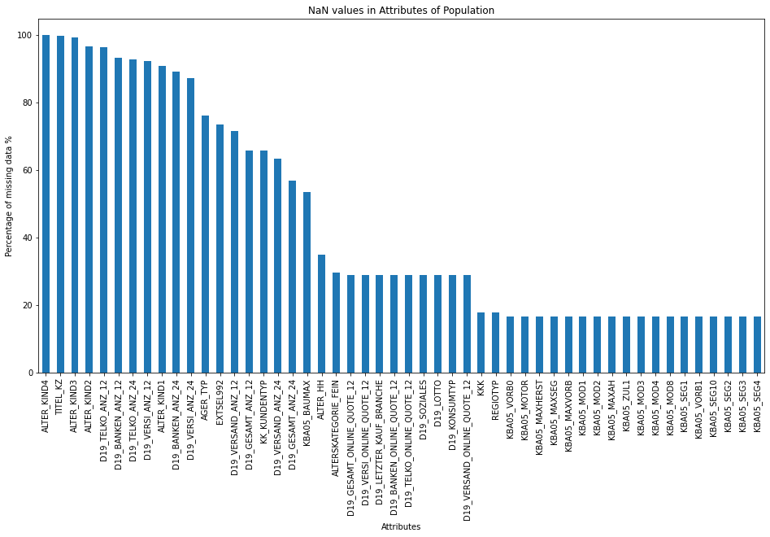](https://github.com/27septembre/Capstone-Project-22/blob/231ca75708e24bf54b1716dc5a903ab40afc1a99/figures/missing_data1.png "NaN in Azdias")

[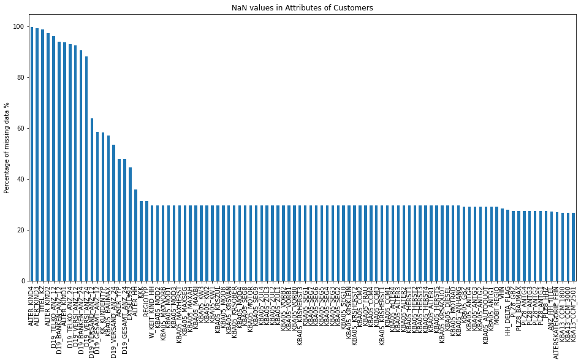](httphttps://github.com/27septembre/Capstone-Project-22/blob/231ca75708e24bf54b1716dc5a903ab40afc1a99/figures/missing_data2.png:// "NaN in Custumer")

#### 3. Clean and Encode with categorical data
There are still three categorical columns [_CAMEO_DEU_2015 _, _EINGEFUEGT_AM _,_OST_WEST_KZ_] in Azidas:

-_CAMEO_DEU_2015_   means  "New German CAMEO Typology established together with Call Credit in late 2015" and is a combination of number and alphabet.  It is dropped for simplification.
-_EINGEFUEGT_AM_   indicates the date of data.  Only the year is kept here.
-_OST_WEST_KZ_  indicates 'flag indicating the former GDR/FRG', can easily encode into 0 and 1.

####  4. Filling NaN data
For both unsupervised and supervised models that I want to use in Sklearn,  there will be no NaN in the data.  To simplify,  I try to fill NaN with mean values.

#### 5. Transform data
To keep all the features equal generally, the data needs to be within a similar range.  After searching on the Internet, MinMaxScaler seems more suitable than StandardScaler here.

### Implementation and Refinement

#### 1. Customer Segmentation Report

##### 1.1 Principal component analysis (PCA)
After data preprocessing,   Azdias and Customer datasets still have 332 features. The principal component analysis (PCA) technique is applied for dimensionality reduction.  In the below figures, the blue bar is for the explained variance of each principal component, the orange bar is for the accumulated explained variance. The first two PCs only explain 0.098 and 0.06 of the total.  From the second figure we can see first 150 PCs contain most of the information (89%). Therefore I set n_components=150 in PCA for simplification.

[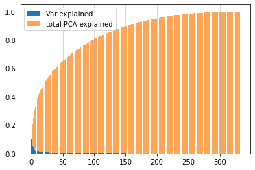](https://github.com/27septembre/Capstone-Project-22/blob/231ca75708e24bf54b1716dc5a903ab40afc1a99/figures/pca1.pnghttp:// "pca1")

[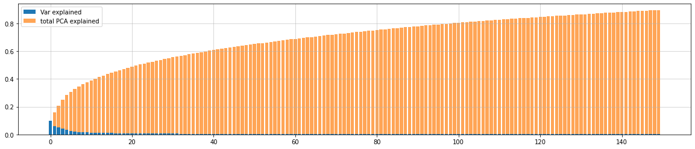](https://github.com/27septembre/Capstone-Project-22/blob/231ca75708e24bf54b1716dc5a903ab40afc1a99/figures/pca2.png "pca2")

##### 1.2 K-Means clustering
The K-Means algorithm clusters data into n groups of equal variance by minimizing a criterion known as the inertia or within-cluster sum-of-squares error (SSE). The elbow plot identifies the best number of clusters for the K-Means algorithm. The elbow figure here shows the relationship between cluster number and SSE. The score decreases sharply for the first 6 clusters and then continues to decrease with a lower slope. I set 10 clusters for K-Means clustering. Then I apply K-Means to make a segmentation of population and customer data. The distributions of population and customers in 10 clusters and their difference demonstrate in the Results part.

[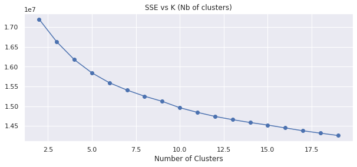](https://github.com/27septembre/Capstone-Project-22/blob/231ca75708e24bf54b1716dc5a903ab40afc1a99/figures/elbow.png "elbow")

#### 2. Supervised Learning Model
In this part,  some binary classifiers ("DecisionTreeClassifier", "RandomForestClassifier",  "GradientBoostingClassifier", "AdaBoostClassifier" ) are used to predict the potential customers.

Before training, similar transformation data preprocessing and cleaning are applied in `Udacity_MAILOUT_052018_TRAIN.csv`. "RESPONSE" in the dataset is the target which indicates who is customer. There are only 532 customers  (1.2% of the total) in the Training data. I use _train_test_split_  from Scikit-learn to split Trian dataset into 80% training and 20% validation set, which is the most common setting in machine learning.

Firstly  I use the four classifiers with default parameters to choose the best classifier. A receiver operating characteristic curve  (roc_auc) is set as the score.  Based on the performance of the validation dataset and the overfitting situation (Fig. ),  
GradientBoostingClassifier is the best model in this case. Its validation score increases up to 65%, while the training score decreases up to 92%.  With Grid search and cross-validation, the best parameters are chosen.

> GBC_classifier = GradientBoostingClassifier(random_state=0)
cv_sets = ShuffleSplit(n_splits=5, test_size=.25, random_state=0)
parameters = {'learning_rate':[0.001,0.01],
             'n_estimators' : [50,100,200],
             'max_depth':[3,5]}
GBC_obj = GridSearchCV(GBC_classifier, 
                             parameters, 
                             scoring = "roc_auc", 
                             cv = cv_sets)
GBC_fit = GBC_obj.fit(X_train, y_train)
GBC_opt = GBC_fit.best_estimator_

## IV. Results

### PCA
n_components=150 is selected for the PCA algorithm. The most important features and their corresponding meaning in the first 2 PCs are shown in the following two figures. Social status and housing holding strongly affect the result in PC1.

[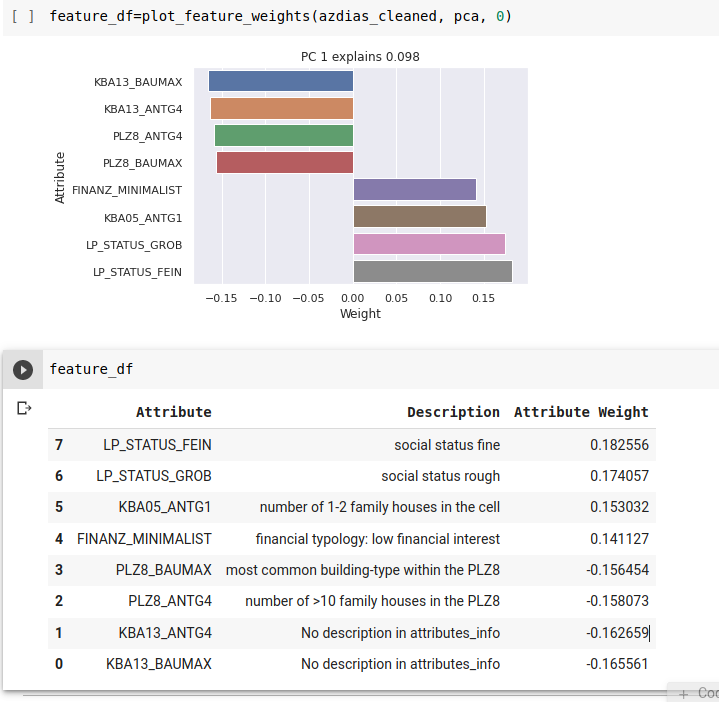](https://github.com/27septembre/Capstone-Project-22/blob/231ca75708e24bf54b1716dc5a903ab40afc1a99/figures/PC1.png "PC1")

[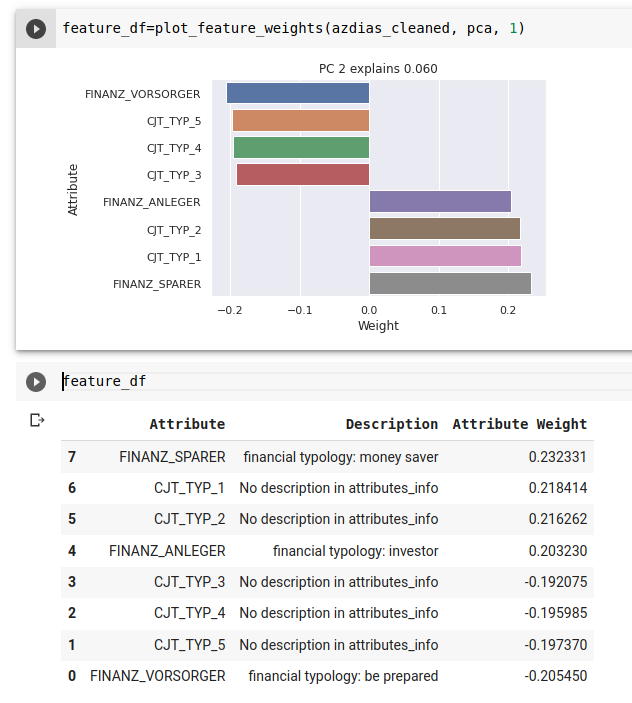](https://github.com/27septembre/Capstone-Project-22/blob/231ca75708e24bf54b1716dc5a903ab40afc1a99/figures/PC2.png "PC2")

### K-Means
The distributions of population and customers in 10 clusters  and their difference demonstrate in the following two figures. Cluster 1,  5, and 7 are overrepresented clusters,  indicating the highest potential to become customers in the future in those groups.

[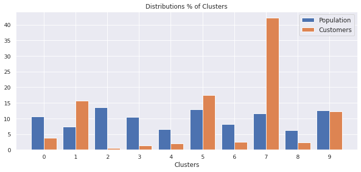](https://github.com/27septembre/Capstone-Project-22/blob/231ca75708e24bf54b1716dc5a903ab40afc1a99/figures/km.png "km")

[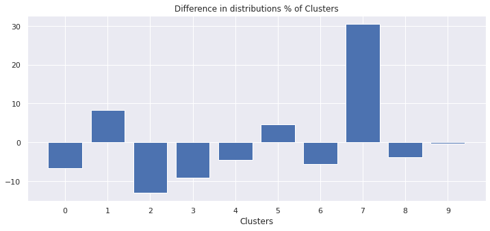](https://github.com/27septembre/Capstone-Project-22/blob/231ca75708e24bf54b1716dc5a903ab40afc1a99/figures/km_dif.png "km_diff")

### Model Evaluation and Validation
[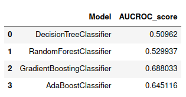](https://github.com/27septembre/Capstone-Project-22/blob/231ca75708e24bf54b1716dc5a903ab40afc1a99/figures/aucroc.png "aucroc")

The roc_auc scores of four classifiers with default parameters are shown here. Based on the performance of the validation dataset and overfitting situation,  GradientBoostingClassifier is the best model in this case with 0.688.

[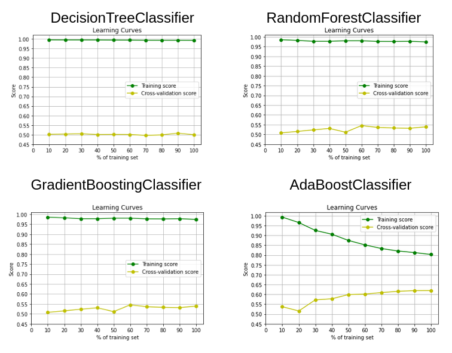](https://github.com/27septembre/Capstone-Project-22/blob/231ca75708e24bf54b1716dc5a903ab40afc1a99/figures/learning_curve.png "learning_curve")

By grid search and cross-validation, the best parameters are chosen in GradientBoostingClassifier.

[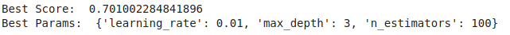](https://github.com/27septembre/Capstone-Project-22/blob/231ca75708e24bf54b1716dc5a903ab40afc1a99/figures/gridSearch.png "gridsearch")

### Justification
The highest score of the prediction is 0.88403 so far in Kaggle Competition.  According to the other works,  the performance of "GradientBoostingClassifier" can be around 0.79. But my best score is only 0.736  in the validation dataset. It could result in non-suitable data cleaning.

### Improvement
-I think that data preprocessing is the key to this project. Extracting information effectively affects both the performance of unsupervised and supervised models. My method of data preprocessing definitely needs to improve.  For example, filling NaNs with mean values is not the best move.  I need to explore more the Attributes spreadsheets to understand better features so that I can make a better decision to keep or drop columns.

-RESPONSE in `Udacity_MAILOUT_052018_TRAIN.csv`only has 1.2% of customers, which will imbalance the model training.

-Improvement in the analysis of results.

-----------
